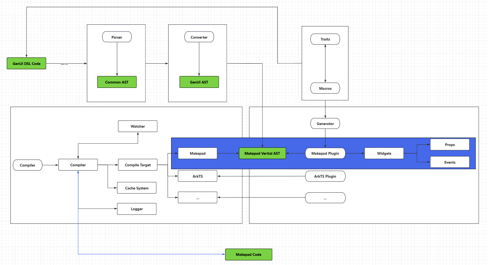

# README

## Work Description

| Dir          | des                                      |
| ------------ | ---------------------------------------- |
|examples|GenUI Example(Working)|
|gen|the finally framework dir(Comming Soon)|
|gen-ui|work dir(Working)|
|wiki|GenUI wiki(Comming Soon)|

- [x] Compiler
- [x] Parser
- [x] Converter
- [ ] Traits
- [ ] Macros
- [ ] Generator
  - [x] Makepad Plugin
  - [ ] Other Plugin
- [ ] GenUI VSCode Plugin
- [ ] GenUI Makepad Unified Widget Lib
- [x] [Makepad Book](https://palpus-rs.github.io/Gen-UI.github.io/)

### Makepad

#### Widgets
- [x] Window
- [x] View
- [x] Button (todo!(button other event, click event finish))
- [x] Icon
- [x] Label 
- [x] Image
- [x] Radio
- [x] Checkbox
- [ ] ScrollXYView
- [ ] ScrollXView
- [ ] ScrollYView
- [ ] TextInput
- [ ] Html
- [ ] Markdown
- [ ] ScrollBar
- [ ] DesktopButton
- [ ] NavControl
- [ ] WindowMenu
- [ ] Splitter

#### Props

- [ ] animation
- [ ] shader
- [ ] Color
  - [x] Base Hex
  - [ ] linear
  - [ ] radial
- [x] widget props

#### Control

- [ ] for
- [ ] if_else

## Architecture

## DSL Design

## Syntax Match

