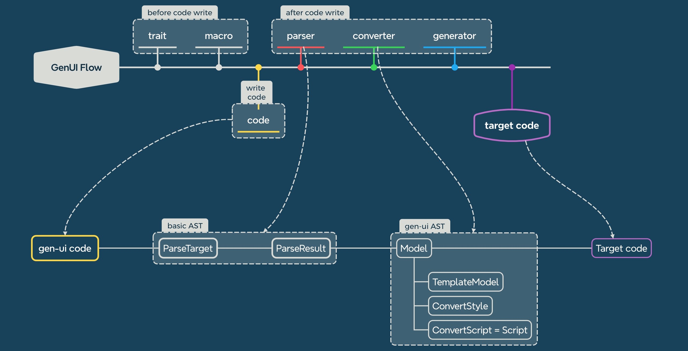

# GenUI Flow

## Features

### Makepad

#### Widgets
- [x] Window
- [x] View
- [x] Button (todo!(button other event, click event finish))
- [x] Icon
- [x] Label 
- [x] Image
- [x] RotatedImage
- [x] Radio
- [x] Checkbox
- [x] ScrollXYView
- [x] ScrollXView
- [x] ScrollYView
- [x] SolidView
- [x] RectView
- [x] RectShadowView
- [x] RoundedView
- [x] RoundedShadowView
- [x] TextInput
- [x] DropDown
- [x] LinkLabel
- [x] FoldButton
- [x] Slider
- [x] SliderBig
- [ ] Slide
  - [ ] SlidesView
  - [ ] SlideBody
- [x] FoldHeader
- [ ] Html
- [ ] Markdown
- [ ] ScrollBar
- [x] DesktopButton
- [ ] NavControl
- [ ] WindowMenu
- [x] Splitter

#### Props

- [ ] animation
- [x] as_prop (WidgetRef)
- [x] Draw
- [x] Color
  - [x] hex
  - [x] linear
  - [x] radial
  - [x] rgb
  - [x] rgba
  - [x] shader 

#### Control

- [ ] for
- [ ] if_else

### ArkUI

### Slint